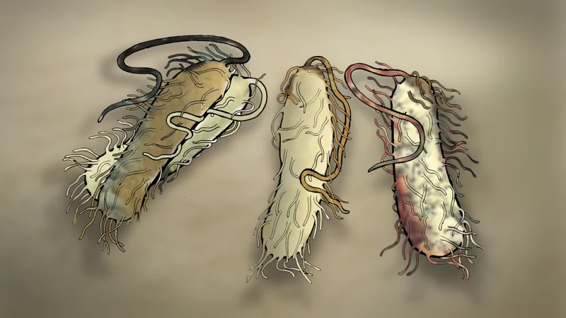
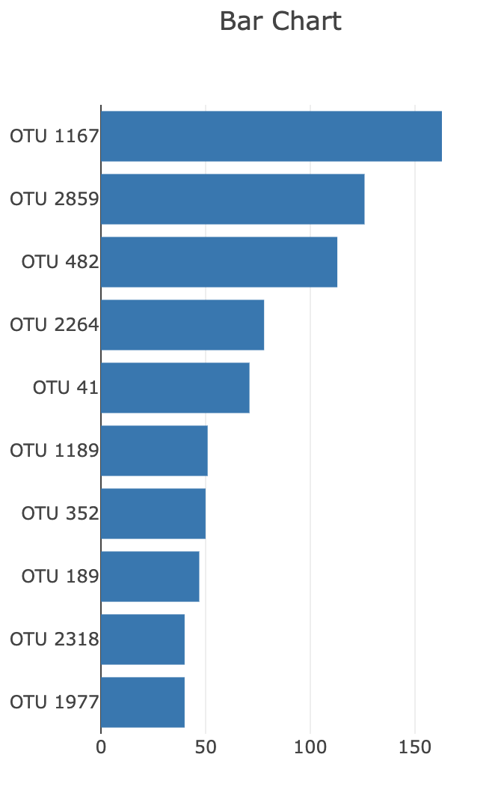
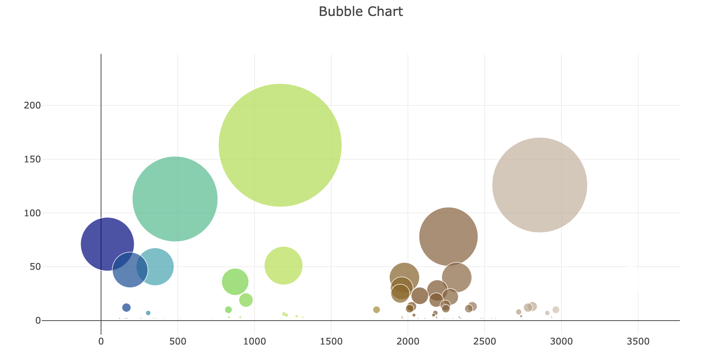
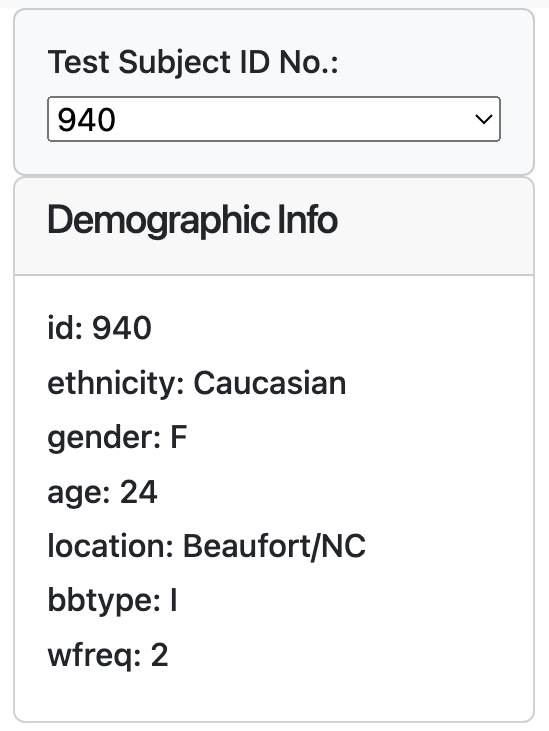
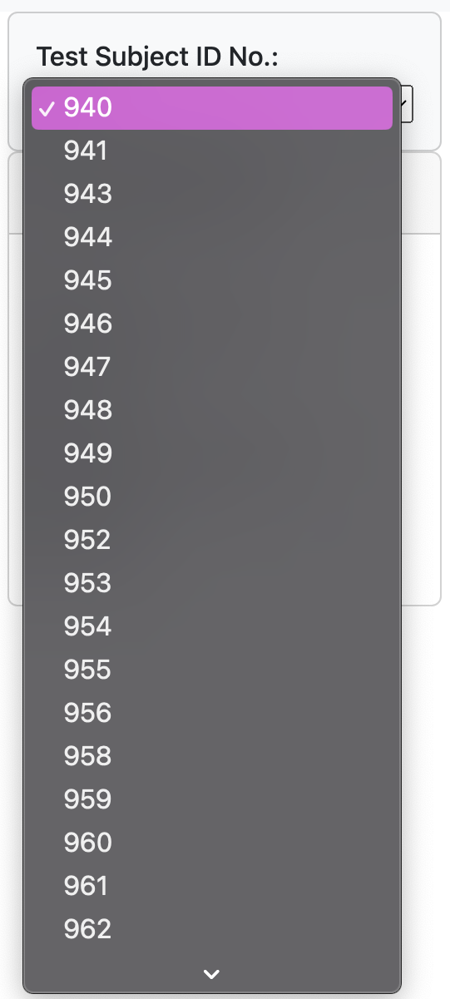

# Belly-Button-Challenge :microbe: 
*In this assignment, I’ll use my JAVA and Interactive Visualisation skills to utilise and extract data from provided url link and convert information analysis.*

# Background

In this assignment, you will build an interactive dashboard to explore the Belly Button Biodiversity datasetLinks to an external site., which catalogues the microbes that colonise human navels.

The dataset reveals that a small handful of microbial species (also called operational taxonomic units, or OTUs, in the study) were present in more than 70% of people, while the rest were relatively rare.

# Step by step

* I used D3 library to read into `samples.json` from provided URL `https://static.bc-edx.com/data/dl-1-2/m14/lms/starter/samples.json`

* I created a horizontal bar chart with a dropdown menu to display top 10 OTUs found in an individual:
    * I used `sample_values` as the values for the chart.
    * `otu_ids` as the labels for the bar chart.
    * `otu-labels` as the hovertext of the chart.

* Then, I created a bubble chart that displays each sample based on the choice in the interactive `demographic dropdown option`:
    * I used `otu_ids` for the X values.
    * `sample_values` for the Y values.
    * `sample_values` for the marker size.
    * `otu_ids` for the marker colours.
    * `otu_labels` for the text values.

* I displayed sample metadata with each key-value pair from metadata JSON object.
Creating an interactive dropdown menu which populates and appends information based on the choice of the ID number selected.

#### Technologies used
* *Visual Studio Code*
* *GitHub* 
* **JavaScript**
* *JSON*

#### File list
* Directory "static" containing: app.js
* index.html, samples.json
* Various Screen Shots in ss direcory.
* README.md

Cover Photo sourced from: https://www.npr.org/sections/krulwich/2011/07/09/137653646/venus-has-a-crowded-belly-button